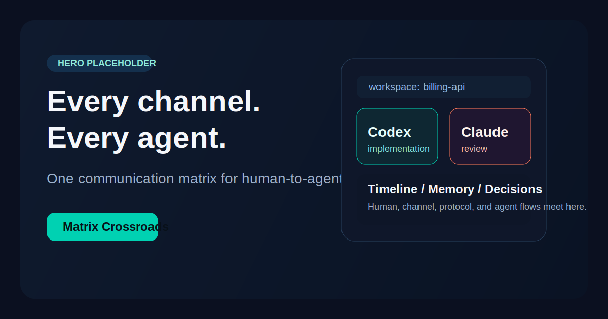
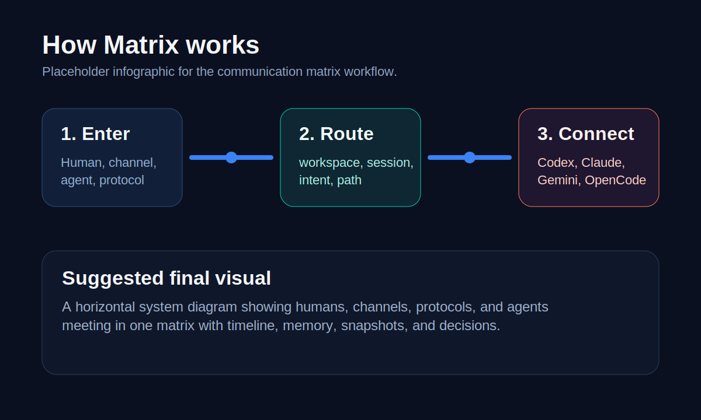
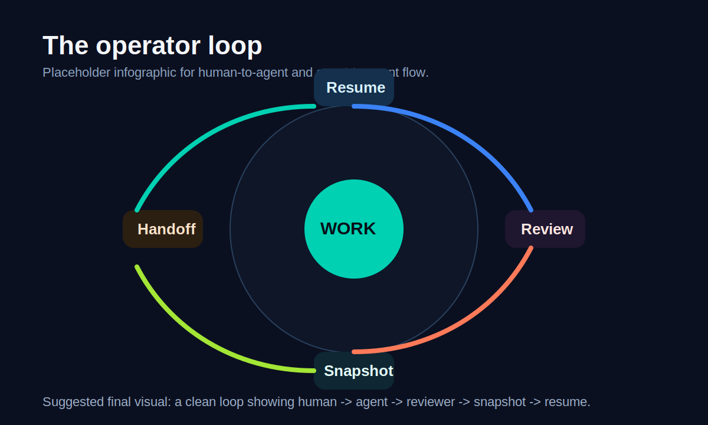

# Matrix

<p align="center">
  <strong>One control plane for real coding agents.</strong><br/>
  Run Codex, Claude, Gemini, OpenCode, ACP, and A2A through one workspace fabric.
</p>

<p align="center">
  
</p>

<p align="center">
  <strong>Local-first.</strong> <strong>Workspace-first.</strong> <strong>Protocol-neutral.</strong>
</p>

## Why Matrix

Most teams do not need another agent framework.

They need one place to:

- keep the active workspace
- keep the live session
- switch specialists without losing the work
- see timeline, memory, snapshots, and decisions

**Matrix is the session fabric for real agents already in the wild.**

## The Claim

> Bring your agents. Keep one operating surface.

That is the product.

Not another agent DSL.  
Not another workflow builder.  
Not another chat wrapper.

## What Makes It Different

- **Real agents, not toy demos**  
  Codex, Claude, Gemini, OpenCode, ACP peers, A2A peers.

- **One workspace fabric**  
  Channels and protocols change. The work context does not.

- **Visible orchestration**  
  Timeline, memory, snapshots, and decision trace stay local-first.

- **One operator surface**  
  Telegram, HTTP, CLI, and future channels share the same semantics.

## How It Works

<p align="center">
  
</p>

1. A user or supervisory AI enters through Telegram, HTTP, or CLI.
2. Matrix resolves workspace, session, intent, and mode.
3. Matrix routes the turn to the right specialist and keeps the work visible.

## The Operator Loop

<p align="center">
  
</p>

This is the loop Matrix is built for:

- implement
- review
- handoff
- snapshot
- resume

## Built For

- developers using more than one coding agent
- teams tired of agent sprawl
- supervisory AI systems that need a reliable orchestration substrate
- local-first operations where visibility matters

## Quick Start

```bash
go build -o matrix ./cmd/matrix
./matrix bootstrap doctor
./matrix run
```

## Core Surfaces

- `POST /v1/runs`
- `POST /v1/session-actions`
- `POST /v1/workspace-actions`
- `GET /v1/workspace-state`
- `GET /v1/workspace-timeline`
- `GET /v1/workspace-memory`
- `GET /v1/workspace-snapshots`
- `GET /v1/workspace-decisions`
- `GET /v1/orchestration-capabilities`
- `POST /a2a`

## Read The Product

- [Product profile](PRODUCT.md)
- [Category thesis](docs/matrix_category_thesis.md)
- [Product roadmap](docs/matrix_product_roadmap_2026_2027.md)
- [Chat UX](docs/matrix_chat_ux_spec.md)
- [Workspace affinity](docs/matrix_workspace_affinity_spec.md)
- [Workspace timeline](docs/matrix_workspace_timeline_spec.md)
- [Protocol-neutral runtime](docs/matrix_v2_protocol_neutral_runtime.md)
- [Orchestration surface](docs/matrix_orchestration_surface_spec.md)
- [Decision trace](docs/matrix_decision_trace_spec.md)
- [Production readiness](docs/matrix_production_readiness.md)
- [Deployment policy](docs/matrix_deployment_policy.md)
- [Threat model](docs/matrix_threat_model.md)
- [Brand direction](docs/brand_direction.md)

## Visual Direction

- **Tone:** sharp, operator-first, technical, controlled
- **Primary colors:** `#0B1020`, `#00D1B2`, `#3B82F6`, `#F5F7FB`
- **Accent colors:** `#FF7A59`, `#A3E635`

The current images are placeholders sized for future infographics and product visuals.
