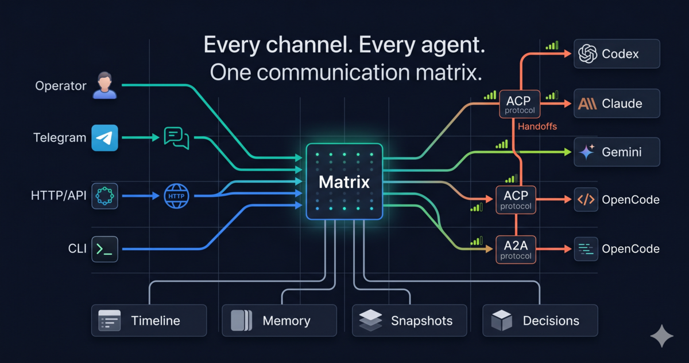
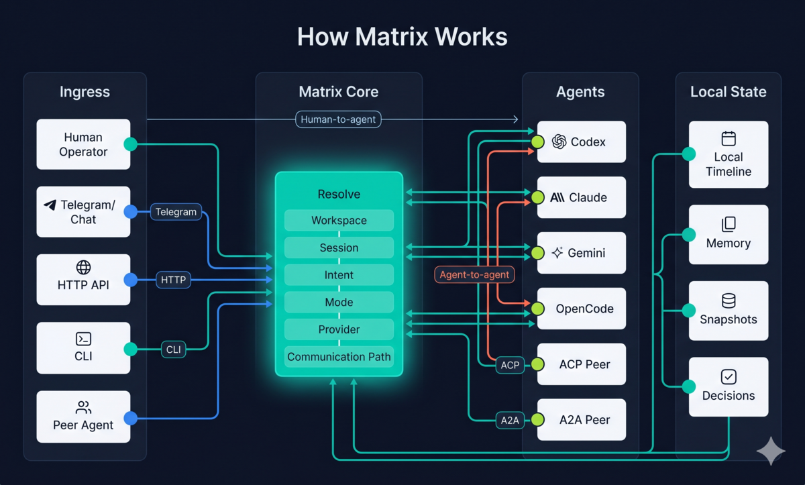
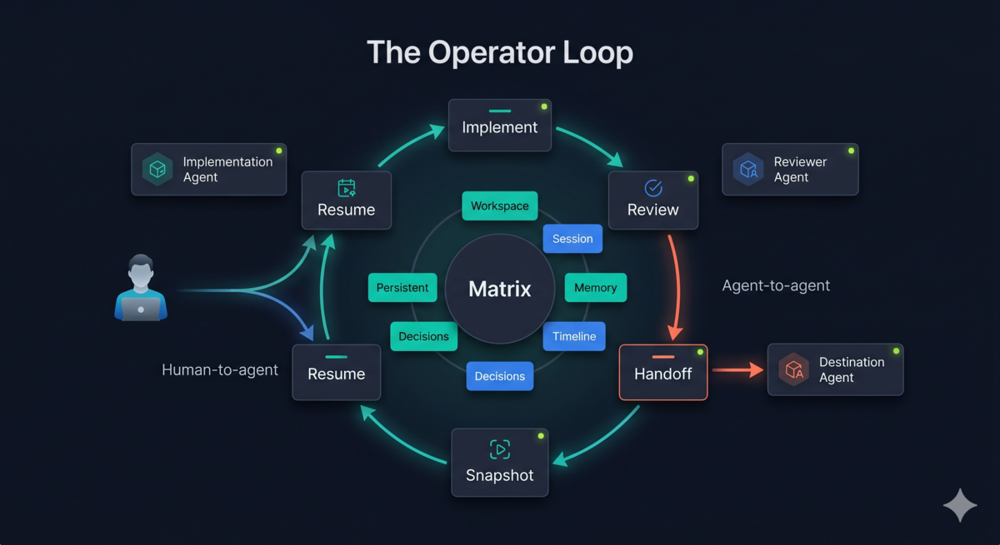

<p align="center">
  <strong>
    <span style="color:#FACC15">⚠️ WARNING: Matrix is in an experimental testing phase.</span>
  </strong><br/>
  <span style="color:#FACC15">APIs, commands, and integrations may change. Great for evaluation and local workflows.</span>
</p>

<p align="center">
  
</p>

<h1 align="center">Matrix</h1>

<p align="center">
  <strong>Your agents. One surface. Local-first.</strong>
</p>

<p align="center">
  Talk to Claude, Gemini, OpenCode, and any ACP/A2A agent from Telegram, HTTP, or CLI.<br/>
  Human to agent. One to many. Agent to agent. Many to many.
</p>

---

## The Problem

You use more than one coding agent. Claude for reasoning. Gemini for speed. OpenCode for open-source work. Each has its own CLI, its own sessions, its own context. There is no way to hand off work between them. No shared memory. No continuity.

**Matrix fixes this.** It is a local-first daemon that sits between you and your agents, giving you one communication surface for all of them.

## What You Get

**One prompt, any agent** -- send a message, Matrix routes it to the right agent.

```bash
curl -X POST http://127.0.0.1:9091/v1/runs \
  -H "Content-Type: application/json" \
  -d '{
    "channel_id": "docs.http",
    "input": "Explain this function"
  }'
```

**Hand off without losing context** -- transfer work from one agent to another mid-session.

```
/handoff claude
```

**Workspaces that remember** -- bind conversations to projects. Get timelines, memory, and snapshots.

```
/use billing-api
/timeline
/snapshot before-refactor
```

**Talk from anywhere** -- Telegram, HTTP API, CLI. Same sessions. Same workspaces. Same state.

**Let agents talk to agents** -- Matrix can be used as a tool by supervisory AIs or coding agents to route work to one agent, many agents, or other agent groups without binding to one protocol.

## Quick Start

Install without cloning the repo.

**Linux / macOS:**

```bash
curl -fsSL https://raw.githubusercontent.com/Josepavese/matrix/main/install/install.sh | sh
matrix bootstrap doctor
matrix run
```

**Windows PowerShell:**

```powershell
irm https://raw.githubusercontent.com/Josepavese/matrix/main/install/install.ps1 | iex
matrix bootstrap doctor
matrix run
```

Prerequisites: at least one coding agent installed (OpenCode, Claude Code, or Gemini CLI). Matrix routes to your agents -- it does not replace them.

**Send your first prompt:**

```bash
curl -X POST http://127.0.0.1:9091/v1/runs \
  -H "Content-Type: application/json" \
  -d '{
    "channel_id": "docs.http",
    "input": "What files are in the current directory?"
  }'
```

## Supported Agents

| Agent | Command | Status |
|-------|---------|--------|
| OpenCode | `opencode acp` | Active by default |
| Gemini CLI | `gemini --experimental-acp` | Active |
| Claude Code | `claude acp` | Available |
| Kimi | `kimi acp` | Available |

Any agent that speaks ACP or A2A works. Search and install more with `matrix agent search`.

## How It Works

<p align="center">
  
</p>

1. A human, channel, agent, or supervisory AI enters through Telegram, HTTP, CLI, ACP, or A2A
2. Matrix resolves workspace, session, intent, protocol, and target agent set
3. Work is routed one-to-one, one-to-many, agent-to-agent, or many-to-many
4. Results flow back. Everything is logged in the workspace timeline.

## The Operator Loop

<p align="center">
  
</p>

Matrix is built for this cycle:

1. **Implement** -- send a prompt, let the agent work
2. **Review** -- `/review` to switch into review mode
3. **Hand off** -- `/handoff claude` to pass work to another agent
4. **Snapshot** -- `/snapshot before-deploy` to save state
5. **Resume** -- `/continue` or `/resume` to pick up later

## What Makes Matrix Different

| | Matrix | Agent frameworks | Chat wrappers | Protocol gateways |
|---|---|---|---|---|
| Uses your existing agents | Yes | No (builds new ones) | Sometimes | Sometimes |
| Agent-to-agent handoff | Yes | Rarely | No | No |
| One-to-many and many-to-many routing | Yes | Sometimes | No | Rarely |
| Workspace memory and timeline | Yes | No | No | No |
| Cross-channel continuity | Yes | No | No | No |
| Local-first with encryption | Yes | Varies | No | Varies |
| Protocol-agnostic | Yes (ACP + A2A) | Usually one | No | Usually one |

## Documentation

### Wiki (start here)

The [Matrix Wiki](docs/wiki/Home.md) is the developer guide. It covers everything you need to get productive:

- [Getting Started](docs/wiki/Getting-Started.md) -- install, configure, first prompt
- [Core Concepts](docs/wiki/Core-Concepts.md) -- workspaces, sessions, agents, channels explained
- [Using Agents](docs/wiki/Using-Agents.md) -- search, install, configure, and switch agents
- [Handoff](docs/wiki/Handoff.md) -- transfer work between agents with context
- [Workspaces](docs/wiki/Workspaces.md) -- timelines, memory, snapshots, decisions
- [Channels](docs/wiki/Channels.md) -- Telegram, HTTP API, CLI setup
- [API Reference](docs/wiki/API-Reference.md) -- every endpoint with examples
- [CLI Reference](docs/wiki/CLI-Reference.md) -- every command documented
- [Examples](docs/wiki/Examples.md) -- step-by-step workflows
- [FAQ](docs/wiki/FAQ.md) -- common questions and troubleshooting

### Product and Design Docs

For contributors and those interested in the product direction:

- [Product profile](PRODUCT.md)
- [Category thesis](docs/matrix_category_thesis.md)
- [Product roadmap](docs/matrix_product_roadmap_2026_2027.md)
- [Chat UX spec](docs/matrix_chat_ux_spec.md)
- [Workspace affinity spec](docs/matrix_workspace_affinity_spec.md)
- [Workspace timeline spec](docs/matrix_workspace_timeline_spec.md)
- [Protocol-neutral runtime](docs/matrix_v2_protocol_neutral_runtime.md)
- [Orchestration surface](docs/matrix_orchestration_surface_spec.md)
- [Decision trace spec](docs/matrix_decision_trace_spec.md)
- [Run trace spec](docs/matrix_agent_communication_run_trace.md)
- [Installation guide](docs/matrix_installation.md)
- [Timeout and recovery](docs/matrix_timeout_recovery_policy.md)
- [Production readiness](docs/matrix_production_readiness.md)
- [Deployment policy](docs/matrix_deployment_policy.md)
- [Threat model](docs/matrix_threat_model.md)
- [Brand direction](docs/brand_direction.md)

## Built For

- Developers using more than one coding agent
- Teams tired of agent sprawl and context loss
- AI-native workflows that need a local communication layer
- Supervisory AI systems that need a reliable routing substrate

## Visual Direction

- **Tone:** sharp, operator-first, technical, controlled
- **Primary:** `#0B1020` `#00D1B2` `#3B82F6` `#F5F7FB`
- **Accent:** `#FF7A59` `#A3E635`
