# Matrix

**Your agents. One surface. Local-first.**

Matrix is a local communication hub for coding agents. It connects people,
scripts and supervisory agents to existing ACP or A2A agents, and keeps their
runs, session identities and project state in one place.

Use OpenCode to implement a change, ask another specialist to review it, or
submit a task from a supervisor and wait for a completion or intervention event.
The agents execute the work; Matrix routes requests, maintains continuity and
makes the outcome inspectable.

[Get started](docs/wiki/Getting-Started.md) · [Wiki](docs/wiki/Home.md) ·
[Releases](https://github.com/Josepavese/matrix/releases) ·
[API](docs/wiki/API-Reference.md)

> **Experimental software.** Commands, APIs and integration contracts can change.
> Check provider capabilities and release notes before depending on a workflow.

## Where Matrix fits

<p align="center">
  
</p>

An **agent** is the tool or harness, such as OpenCode or Codex through its ACP
adapter. A **model** is the backend that agent uses. Matrix can request a model
where the protocol supports it; credentials, subscriptions and inference stay
with the provider.

Matrix runs on **Linux, macOS and Windows** through a platform abstraction layer
(PAL). It stores its runtime state under one OS-native application home. An
agent or model service can still be remote: local-first describes Matrix's
control and state, not where every prompt is processed.

## What you can do

| Need | Matrix provides |
|---|---|
| Reach several agents from one place | Telegram, authenticated HTTP, CLI and protocol adapters into a common routing core |
| Keep work attached to a project | Explicit workspace roots, session bindings, timeline, work memory and state snapshots |
| Continue or import an existing conversation | Distinct logical and provider session IDs; capability-gated load, resume, discovery and fork |
| Move work to another specialist | A recorded handoff brief delivered on the destination's next turn |
| Delegate without watching every token | Async runs, run events, input requests, cancellation and durable local notifications on Linux/macOS |
| Attach supervisory context | Sidecar capsules with delivery traces, separate from normal chat text |
| Understand a failure | Run traces, requested/effective model information, stall views and typed recovery outcomes |
| Control execution resources | Optional provider permissions, Docker isolation and runtime admission based on concurrency and workspace disk capacity |
| Inspect or export operational state | Read-only semantic filesystem, optional native mount, local logs and optional bounded OTLP/HTTP log export |

Matrix exposes coordination primitives. Your supervisor or application defines
its workflow, parallelism and review policy. Provider features are negotiated;
an unsupported resume or fork is reported rather than simulated.

The same core supports four communication patterns:

| Pattern | Example |
|---|---|
| **Human to agent** | A developer sends a task from Telegram or HTTP |
| **Agent to agent** | A supervisor delegates to a specialist through Matrix |
| **One to many** | One caller submits separate runs to several specialists |
| **Many to many** | Several callers and agents coordinate through explicit run/session/workspace bindings |

## Quick start

You need an installed, authenticated agent with a compatible adapter, or a
configured remote A2A endpoint. Matrix can discover and install registry agents;
installing Matrix alone does not configure a model account.

### 1. Install without cloning the repo

Linux / macOS — download the installer for one resolved version, inspect it,
then run it:

```bash
MATRIX_VERSION="$(curl -fsSL https://api.github.com/repos/Josepavese/matrix/releases/latest | sed -n 's/.*"tag_name": "\(v[^"]*\)".*/\1/p' | head -n 1)"
curl -fsSLO "https://github.com/Josepavese/matrix/releases/download/${MATRIX_VERSION}/install.sh"
less install.sh
env MATRIX_VERSION="$MATRIX_VERSION" sh install.sh
```

Windows PowerShell:

```powershell
$release = Invoke-RestMethod https://api.github.com/repos/Josepavese/matrix/releases/latest
$env:MATRIX_VERSION = $release.tag_name
Invoke-WebRequest "https://github.com/Josepavese/matrix/releases/download/$env:MATRIX_VERSION/install.ps1" -OutFile install.ps1
notepad install.ps1
.\install.ps1
```

For repeatable installs, use an explicit `vX.Y.Z`. No repository clone is needed.

### 2. Check the agent and register a project

This example uses an already working OpenCode installation. Replace its ID and
path with your setup:

```bash
matrix bootstrap doctor
matrix agent list
matrix agent doctor opencode
matrix workspace add my-project --path /absolute/path/to/project --default-agent opencode
matrix run
```

`matrix run` stays in the foreground. If Matrix already runs as a service, use
that instance. Bootstrap doctor reports setup guidance; it does not sign into
providers. See [agent setup](docs/wiki/Using-Agents.md).

### 3. Send a task from another terminal

The daemon generates an HTTP key on startup. This Bash example loads it locally
and names the project explicitly:

```bash
MATRIX_API_KEY="$(matrix config get matrix_api_key)"
curl --fail-with-body -sS http://127.0.0.1:9091/v1/runs \
  -H "X-Matrix-Key: $MATRIX_API_KEY" \
  -H "Content-Type: application/json" \
  -d '{
    "channel_id": "docs.http",
    "agent_id": "opencode",
    "workspace_id": "my-project",
    "execution_mode": "sync",
    "input": "Explain this project. Read files as needed; do not modify them."
  }'
```

The instruction above is a task request, not an enforced read-only sandbox.
[Getting Started](docs/wiki/Getting-Started.md) also includes a PowerShell request.

## Delegate, then return when needed

<p align="center">
  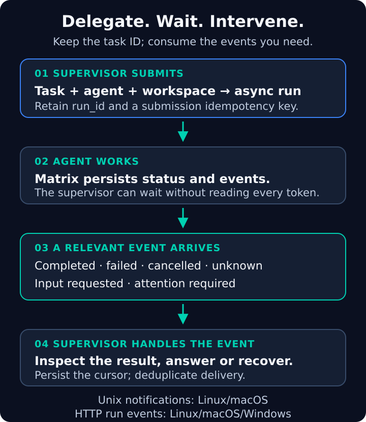
</p>

For example, submit a repository review with `execution_mode: "async"`, retain
its `run_id`, and consume events instead of feeding the whole transcript into
the supervisor's context. On Linux/macOS, `matrix run wait <run-id>` reads the
private notification socket. Supervisors can listen directly for input requests
and terminal outcomes, persist a cursor, and acknowledge delivery.

Windows clients use the HTTP run event stream and elicitation API; the Unix
notification socket and its wait/ack commands are not available there.
[Delegation and Notifications](docs/wiki/Delegation-and-Notifications.md) explains
the delivery guarantees and runnable requests.

## Agents and protocols

The shipped seed definitions include **OpenCode, Gemini CLI, Claude Code's ACP
adapter and Kimi**. **Codex** has a dedicated ACP installation and launch
contract. **MiMo Code** can be registered as an ACP agent and has a native
permission contract. Registry entries and your local configuration determine
which agents are installed and enabled.

### Agents on ACP

The ecosystem below follows [Zed’s ACP agent directory](https://zed.dev/acp).
Matrix connects through the agent’s native ACP support or its adapter; install,
authentication and available session/model operations depend on that integration.

<p align="center">
  <a href="https://zed.dev/acp/agent/agentpool">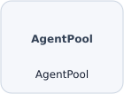</a>
  <a href="https://zed.dev/acp/agent/agoragentic-acp"></a>
  <a href="https://zed.dev/acp/agent/amp-acp">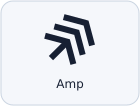</a>
  <a href="https://zed.dev/acp/agent/augment-code">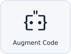</a>
  <a href="https://zed.dev/acp/agent/autohand">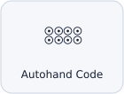</a>
  <a href="https://zed.dev/acp/agent/blackbox-ai">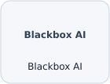</a>
  <a href="https://zed.dev/blog/claude-code-via-acp">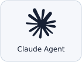</a>
  <a href="https://zed.dev/acp/agent/cline">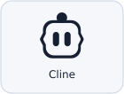</a>
  <a href="https://zed.dev/acp/agent/code-assistant">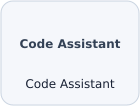</a>
  <a href="https://zed.dev/acp/agent/codebuddy-code"></a>
  <a href="https://zed.dev/blog/codex-is-live-in-zed">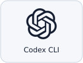</a>
  <a href="https://zed.dev/acp/agent/cortex-code">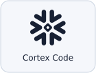</a>
  <a href="https://zed.dev/acp/agent/corust-agent"></a>
  <a href="https://zed.dev/acp/agent/crow-cli">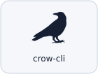</a>
  <a href="https://zed.dev/acp/agent/cursor"></a>
  <a href="https://zed.dev/acp/agent/deepagents">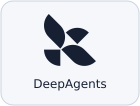</a>
  <a href="https://zed.dev/acp/agent/devin">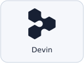</a>
  <a href="https://zed.dev/acp/agent/dimcode">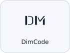</a>
  <a href="https://zed.dev/acp/agent/dirac">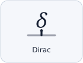</a>
  <a href="https://zed.dev/acp/agent/docker-cagent">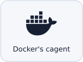</a>
  <a href="https://zed.dev/acp/agent/factory-droid">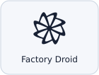</a>
  <a href="https://zed.dev/acp/agent/fast-agent">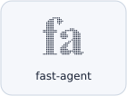</a>
  <a href="https://zed.dev/acp/agent/gemini-cli">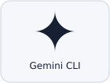</a>
  <a href="https://zed.dev/acp/agent/github-copilot">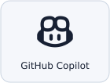</a>
  <a href="https://zed.dev/acp/agent/glm-acp-agent">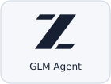</a>
  <a href="https://zed.dev/acp/agent/antigravity-acp">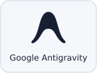</a>
  <a href="https://zed.dev/acp/agent/goose">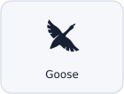</a>
  <a href="https://zed.dev/acp/agent/grok-build">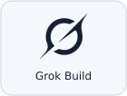</a>
  <a href="https://zed.dev/acp/agent/harn">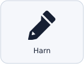</a>
  <a href="https://zed.dev/acp/agent/junie"></a>
  <a href="https://zed.dev/acp/agent/kilo">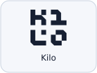</a>
  <a href="https://zed.dev/acp/agent/kimchi">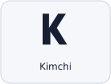</a>
  <a href="https://zed.dev/acp/agent/kimi-cli">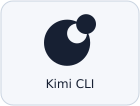</a>
  <a href="https://zed.dev/acp/agent/kiro-cli">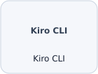</a>
  <a href="https://zed.dev/acp/agent/minimax-code">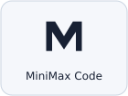</a>
  <a href="https://zed.dev/acp/agent/minion-code">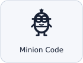</a>
  <a href="https://zed.dev/acp/agent/mistral-vibe">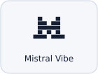</a>
  <a href="https://zed.dev/acp/agent/nova">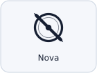</a>
  <a href="https://zed.dev/acp/agent/opencode">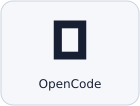</a>
  <a href="https://zed.dev/acp/agent/openhands">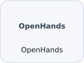</a>
  <a href="https://zed.dev/acp/agent/pi">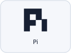</a>
  <a href="https://zed.dev/acp/agent/poolside">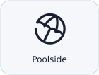</a>
  <a href="https://zed.dev/acp/agent/qoder-cli">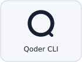</a>
  <a href="https://zed.dev/acp/agent/qwen-code">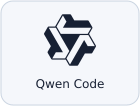</a>
  <a href="https://zed.dev/acp/agent/sigit">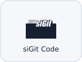</a>
  <a href="https://zed.dev/acp/agent/stakpak">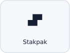</a>
  <a href="https://zed.dev/acp/agent/vt-code">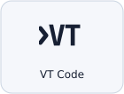</a>
</p>

Browse agents with `matrix agent search` and inspect your installation with
`matrix agent doctor <id>`. This is an ecosystem directory, not a claim that
all entries have passed Matrix end-to-end qualification. [Icon sources](docs/assets/readme/agents/SOURCES.md).

- ACP: managed stdio agents and configured external transports; session and model
  operations depend on advertised capabilities.
- A2A: remote agent registration, protocol bindings and task communication.
- Agent-to-agent workflows: callers use the same run and session surfaces as
  other clients. Matrix does not need a separate model subscription to route them.

See [Using Agents](docs/wiki/Using-Agents.md) and the
[protocol coverage](docs/protocol_coverage.md) for exact support and limits.

## Execution, privacy and platform support

- **Provider permissions and OS isolation are distinct.** OpenCode/MiMo policies
  are configured, not attested. Optional Docker isolation requires a prepared
  local Linux image and explicit workspace/state/resource settings.
- **Capacity is host capacity.** Admission limits cover this Matrix runtime and
  volume reservations are bookkeeping; they are not disk quotas or provider credits.
- **State views are selective.** The semantic filesystem exposes agent, run and
  workspace state, not project files or a semantic search engine. Summaries are
  an explicit CLI/mount opt-in; HTTP views exclude them.
- **Export is optional.** The OTLP collector receives selected operational logs,
  not prompt/transcript content or billing data. Local logs remain primary.
- **Local storage needs protection.** Vault encryption uses a configured master
  key; local-first alone does not mean encrypted. HTTP authentication and
  Telegram administrator controls are enforced by default.

Native PAL contracts are tested on Linux, Windows and macOS. Real container and
FUSE qualification is recorded for Linux; Windows/macOS Docker and mount drivers
still require qualification in the intended environment. See the
[PAL guide](docs/wiki/PAL-Execution-and-Observability.md) and
[v0.1.53 evidence](docs/governance/releases/2026-10-08-v0.1.53.md).

## Wiki

The [versioned Wiki](docs/wiki/Home.md) lives in this repository alongside the
code. Start with a task, then follow the relevant guide:

| Start here | Go deeper |
|---|---|
| [Getting Started](docs/wiki/Getting-Started.md) | Installation, agent readiness and first prompt |
| [Core Concepts](docs/wiki/Core-Concepts.md) | Agents, models, runs, sessions, workspaces and channels |
| [Delegation and Notifications](docs/wiki/Delegation-and-Notifications.md) | Async work, wakeups, cursors and intervention |
| [Sessions and Recovery](docs/wiki/Sessions-and-Recovery.md) | External import, strict identity and interrupted runs |
| [Handoff](docs/wiki/Handoff.md) / [Sidecar Capsules](docs/wiki/Sidecar-Capsules.md) | Specialist briefs and supervisory context |
| [Workspaces](docs/wiki/Workspaces.md) / [Channels](docs/wiki/Channels.md) | Project state, Telegram, HTTP and CLI |
| [PAL Execution and Observability](docs/wiki/PAL-Execution-and-Observability.md) | Sandbox, capacity, semantic filesystem and collector |
| [CLI Reference](docs/wiki/CLI-Reference.md) / [API Reference](docs/wiki/API-Reference.md) | Commands and wire contracts |
| [Examples](docs/wiki/Examples.md) / [FAQ](docs/wiki/FAQ.md) | Workflows, limits and troubleshooting |

## Development

- [Contribution guide](CONTRIBUTING.md), [test guide](tests/README.md) and
  [quality gates](docs/quality_gate.md).
- [Governance](docs/wiki/Governance.md), [release runbook](docs/matrix_release_runbook.md)
  and [security policy](SECURITY.md).
- [Product thesis](docs/matrix_category_thesis.md) and
  [roadmap](docs/matrix_product_roadmap_2026_2027.md) describe direction; they are
  not a list of shipped capabilities.

Licensed under [Apache-2.0](LICENSE).
