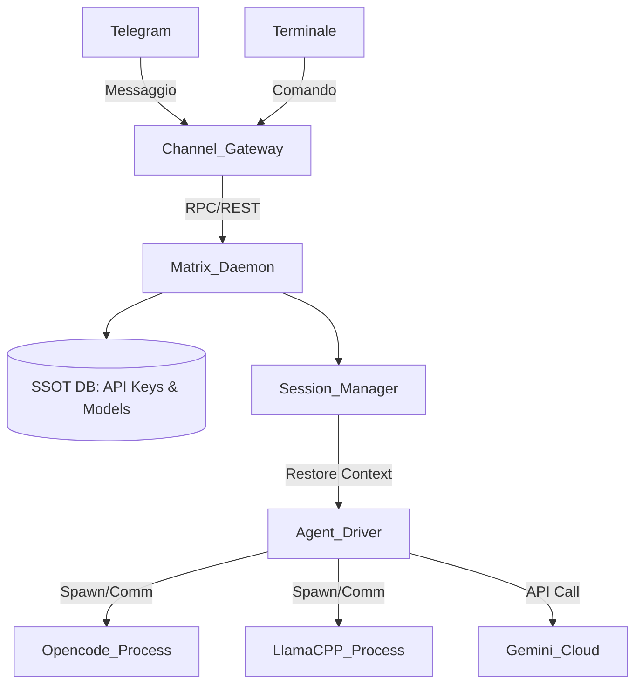

# Matrix V2 🌌
## The Universal AI Agent Operating System

**Status:** Vision / RFC (Request for Comments)
**Linguaggio Core:** Golang
**Codename:** Zion

---

## 1. Contesto e Filosofia
L'attuale ecosistema degli agenti AI (locali e cloud) è frammentato. Ogni strumento (Opencode, Codex, Kimi, Claude, Gemini) ha il suo modo di gestire la configurazione, la memoria, il contesto e le dipendenze. Quando si cerca di automatizzarli o esporli su canali diversi (Telegram, WhatsApp, CLI), la perdita di contesto (statelessness) e la complessità di configurazione diventano ostacoli insormontabili.

**Filosofia di Matrix V2:**
Matrix non è più solo un "bridge" o un file JSON condiviso. Matrix diventa un **Demone di Sistema (System Daemon)**, un vero e proprio "Sistema Operativo per Entità AI". 
Il suo scopo è astrarre la complessità di installazione, configurazione e gestione della memoria degli agenti, fornendo un'unica interfaccia pulita, persistente e centralizzata per l'utente e per i canali di comunicazione.

---

## 2. Obiettivi (Goals) vs Non-Obiettivi (Non-Goals)

### Goals
- **Single Source of Truth (SSOT) Assoluta**: Un solo file/database per API keys, quote di spesa, limitazioni e preferenze di modelli. Nessun file di configurazione sparso per il sistema.
- **Gestore di Pacchetti AI (AI Package Manager)**: Capacità di installare, aggiornare e configurare agenti locali (es. `matrix install opencode`, `matrix install llama-cpp`).
- **Memoria Perfetta (Stateful by Design)**: Gestione delle sessioni indipendente dal canale. Se parlo con Opencode su Telegram, la sessione e il contesto del terminale (CWD, variabili, history) vengono preservati ESATTAMENTE come se stessi usando la CLI nativa nel mio editor.
- **Routing Multicanale Unificato**: WhatsApp, Telegram, CLI, REST API, WebSocket nativi. Tutto converge in un router centrale.
- **Alte Prestazioni**: Scritto in Go per concorrenza nativa (Goroutines), basso footprint di memoria e binari protatili single-file.

### Non-Goals
- Essere un LLM Provider (Matrix non fa inferenza, la delega).
- Sostituire interfacce grafiche esistenti (Matrix espone API e una CLI potente, la GUI è opzionale o demandata a frontend esterni).

---

## 3. Architettura Strutturale (Golang)

Il passaggio a Go permette di passare da un "esecutore di script sincroni" (come era in Node/Python) a un Server Event-Driven altamente concorrente.

### Componenti Core:
1. `Matrix Daemon (matrixd)`: Il processo server in background. Tiene in RAM le sessioni attive e gestisce le code di messaggi.
2. `Matrix CLI (matrix)`: Il client da riga di comando per l'utente umano.
3. `SSOT Vault`: Un database (es. SQLite embedded o BoltDB in Go) criptato dove risiedono le chiavi API e le regole di routing.
4. `Agent Drivers`: Moduli in Go che implementano un'interfaccia comune (`AgentDriver`). Ogni driver sa come spawnare, configurare e iniettare prompt in un agente specifico (Opencode, Kimi, etc.).
5. `Channel Listeners`: Moduli che ascoltano eventi esterni (Telegram webhook, WhatsApp Baileys connesso via gRPC/WS al demone Go).

### Schema di Flusso:


---

## 4. Innovazioni Core: Preservazione della Memoria (Exact Memory Preserve)

Il più grande difetto dei bridge attuali è che ogni comando è "stateless". Matrix V2 risolve questo problema con:

- **Virtual TTY / PTY Muxing**: Quando Matrix avvia un agente interattivo (es. Opencode), non usa chiamate API isolate. Crea uno pseudo-terminale (PTY) persistente in background.
- **Session ID Universali**: Quando scrivo da Telegram, Telegram mi assegna una `Session_ID`. Matrix "associa" questa `Session_ID` al PTY di Opencode in esecuzione. 
- **Shadow Context Mapping**: Matrix inietta costantemente in background lo stato del tuo computer (es. l'output dell'ultimo comando fallito sul tuo laptop) nel contesto dell'agente, in modo che l'agente cloud "veda" il tuo computer locale.

*(Esempio: Su Telegram scrivi "fixa l'errore che mi ha appena dato il compilatore". Matrix sa qual è l'errore perché la sessione cli "matrix-run" lo ha intercettato).*

---

## 5. Feature "Esplosive" nel Mondo AI Agents 🚀

Queste sono le Killer-Feature che posizionano Matrix oltre qualsiasi tool esistente:

### A. Agent Swarm / L'Alveare (Multi-Agent Debate)
Invece di parlare con un solo agente, puoi evocare un team.
*Comando:* `/swarm build un server web in go`
*Sotto il cofano:*
1. Matrix incarica **Opencode** di scrivere il codice.
2. Matrix redireziona l'output di Opencode a **Codex/Kimi** per una Code Review di sicurezza.
3. Se Kimi trova difetti, Matrix automatizza il dibattito tra i due finché non compilano un codice perfetto.
4. Matrix invia l'esito finale a te su Telegram.

### B. "Time-Travel" Snapshotting delle Sessioni
Salvataggio dello stato della memoria come se fossero commit di Git.
L'agente sta scrivendo una feature ma prende una "strada" sbagliata allucinando?
*Comando:* `matrix session rollback --steps 5`
Matrix ripristina l'esatto contesto di prompt di 5 turni fa, cancellando i rami morti, e permettendo all'agente di riprendere il lavoro da zero senza "inquinamento" del contesto.

### C. Agentic Package Manager (APM)
Un `apt-get` o `brew` per agenti e prompt complessi.
*Comando:* `matrix install agent:opencode@latest`
Matrix clona il repo, imposta il suo ambiente Python virtuale in isolamento (niente più conflitti PIP sul sistema), inietta la API key dalla SSOT e lo espone come demone locale pronto all'uso.

### D. Semantic FUSE Mount (Filesystem Semantico)
Matrix espone una cartella `/mnt/matrix/`.
Dentro non ci sono veri file, ma "query" materializzate degli agenti. 
Se fai un `cat /mnt/matrix/explain_my_project.md`, in realtà Matrix sta istruendo Claude/Gemini di leggere il tuo workspace attuale e generare uno stream al volo. Per l'OS, sembrerà un semplice file di testo. E' l'integrazione ultima tra Sistema Operativo e LLM.

### E. Dynamic Cost-Routing (Smart Fallback V2)
Evoluzione del file `cascade.py`.
Matrix analizza la complessità della tua query usando un modello piccolo locale (es. Llama 3 8B). 
- Se chiede "che ore sono", risponde il modello locale (Cost: 0$).
- Se chiede "refattorizza questo cluster Kubernetes", innesca Claude 3.5 Sonnet / Deepseek V3 (Cost: $$).
Ottimizzazione automatica dei costi SaaS senza dover mai specificare il modello a mano.

---

## 6. Esempi di Utilizzo Futuro (User Experience)

**1. Installazione Zero-Config**
```bash
# Matrix scarica e isola l'agente
$ matrix install opencode

# Aggiungi chiave una sola volta. Valida per TUTTI gli agenti installati.
$ matrix config set provider.openrouter.api_key "sk-..."
```

**2. Sessione Persistente Telegram ↔ CLI**
Sul terminale del computer in ufficio:
```bash
$ matrix tunnel --attach my_project_session
```
Sul treno, da Telegram scrivi al Bot:
*"Generami i testi per la pagina index.html che stavo modificando."*
Il demone ricollega la conversazione di Telegram alla `my_project_session` attiva in ufficio. Opencode sa esattamente cosa stavi facendo perché sta operando nello stesso ambiente virtuale del tuo computer.

**3. Risoluzione Errori Autonoma (Shadow Mode)**
Un comando fallisce sul tuo terminale:
```bash
$ npm run build
> ERROR: Cannot find module 'react'
```
Subito dopo, Matrix interviene (perché è in ascolto della pipe del tuo terminale):
```text
[Matrix-Kimi]: Ho notato che la build è fallita. C'è 'react' mancante nel package.json. Vuoi che esegua "npm install react" per te? [Y/n]
```

---

## 7. Primi Passi di Sviluppo (Roadmap Tecnica)
- **Fase 1: Daemon & SSOT (Go)**: Creare `matrixd`, implementare BoltDB/SQLite per salvare le credenziali e implementare un server gRPC per la CLI.
- **Fase 2: Process Manager**: Scrivere il wrapper in Go che avvia processi figli (Opencode), gestisce i PTY (pseudo-terminal) in lettura/scrittura in maniera asincrona senza bloccare l'IO.
- **Fase 3: WebSocket/REST API Gateway**: Esporre interfacce pulite per agganciare in modo nativo Telegram e WhatsApp.
- **Fase 4: APM (Agent Package Manager)**: Logica per scaricare, creare venv, e installare agenti di terze parti in chroot/environment isolati.
