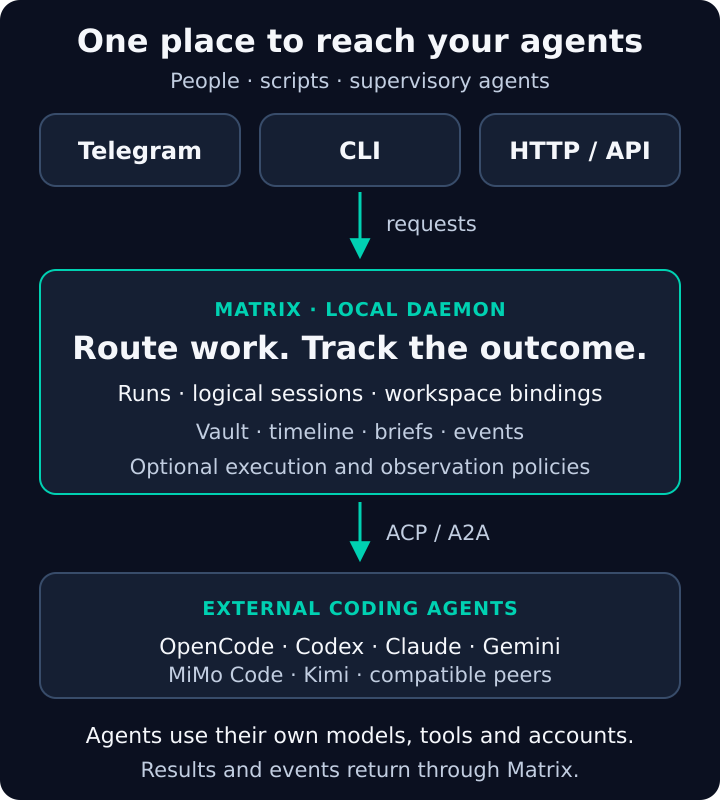

# Core Concepts

Matrix separates the execution tool from the work and the place where you access it.

## Agents and models

An **agent** is an external harness with tools, credentials and a protocol
adapter. A **model** is the backend it calls. OpenCode and MiMo Code can use
several model providers; Codex uses its ACP adapter. Changing an agent and
changing a model are different operations.

Matrix registers an agent command or endpoint, negotiates capabilities and
routes work. Installed, enabled, registered and ready are different states.
Use `matrix agent list` and `matrix agent doctor <agent-id>` to inspect them.
[Using Agents](Using-Agents.md) describes the seed agents and installation paths.

## Runs

A **run** is one submitted task execution, identified by `run_id`. HTTP supports
`sync`, `async` and `stream`. A run has persisted status, events and a trace.
It can complete, fail, be cancelled or have an unknown outcome after interruption.
An accepted submission is not evidence of a successful task.

A supervisor can submit several tasks through Matrix, but owns its scheduling,
review and retry decisions. See [Delegation and Notifications](Delegation-and-Notifications.md).

## Sessions

A **logical session** is Matrix's local conversation record. A **remote session**
is the provider's conversation, identified separately by `remote_session_id`.
They are related records, not interchangeable IDs.

Session actions include discovery, new, switch, import, cancel, cleanup and
capability-gated resume/load/fork. `matrix session attach <channel-id> <session-id>`
attaches a channel to an existing logical session; it does not list sessions.
Provider state must still exist and the provider must support restoration.
[Sessions and Recovery](Sessions-and-Recovery.md) explains external import and failures.

## Workspaces

A **workspace** names a project root and stores Matrix work state for it:

- Timeline: recorded lifecycle and routing events.
- Memory: locally mirrored turns; content may be private.
- Snapshots: session/agent/mode and references at a point in time.
- Decisions: routing and intent records.

Create one with `matrix workspace add project-name --path /absolute/project/root`.
Select it in chat with `/use project-name` or name it in an HTTP request.
Snapshots do not copy project files or provide source-code rollback. Work memory
is not a shared provider-native transcript automatically loaded by every agent.
See [Workspaces](Workspaces.md).

## Channels

A **channel** identifies a caller or conversation: Telegram chat, HTTP caller,
or another integration. Channel bindings select the current workspace/session.
The underlying records are shared, but moving from Telegram to HTTP does not
attach the new channel automatically. Bind or switch explicitly.

HTTP and chat use common action contracts. The CLI exposes selected operations;
not every HTTP action has a dedicated CLI command. See [Channels](Channels.md).

## Handoff and sidecar capsules

A **handoff** prepares a destination session and a brief with source identity,
workspace, mode and an operator note. The destination gets that brief on its next
turn. It does not import the source agent's entire private conversation.
[Handoff](Handoff.md) gives a complete example.

A **sidecar capsule** attaches structured supervisory context to a task. Matrix
projects it into the selected protocol and records delivery. Delivery is not
proof the model used the context or that the task succeeded.
[Sidecar Capsules](Sidecar-Capsules.md) describes visibility and live attachment.
ACP has no `session/side` method; native fork is a separate, capability-gated operation.

## How they fit together

## The operator loop

Select a workspace, submit a task, inspect its result, hand off a brief when a
specialist changes, and continue the appropriate provider session later.
Use `/snapshot before-review` to record Matrix state, and Git or your project
backup process to preserve source files.

## Execution and observation

PAL means **platform abstraction layer**. Its native home, capacity observers
and execution contracts cover Linux, Windows and macOS. Optional container/mount
features need installed drivers and separate real-environment qualification.
Capacity measures host resources, not provider token or money balances.
[PAL Execution and Observability](PAL-Execution-and-Observability.md) gives details.

## Glossary

| Term | Meaning |
|---|---|
| Vault | Local database storing Matrix configuration and runtime state; encryption requires a master key |
| Intent | Operation such as continue, review, explain, triage or handoff |
| Mode | Work mode associated with the session |
| Meta-agent | Configured agent handling `/action` administration requests |
| ACP fork | Provider-created branch, used only when advertised |
| Additional directories | Provider-gated extra roots beyond the session workspace |
| Trace | Inspectable run record under the caller's content/redaction policy |
